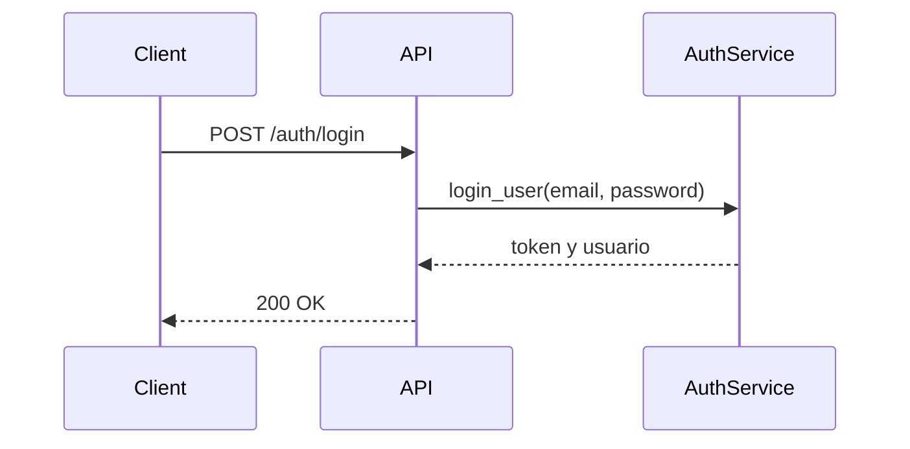

# API-001 Login de usuario

## Estado

Borrador

## Objetivo

Describir el contrato tecnico del endpoint de autenticacion por email y contraseña.

## Endpoint

- metodo: `POST`
- ruta: `/api/auth/login`

## Autenticacion

- publica

## Request

### Body

```json
{
  "email": "user@example.com",
  "password": "Secret123!"
}
```

## Response esperada

### Exito

```json
{
  "access_token": "jwt",
  "user": {}
}
```

## Diagrama Mermaid opcional



## Errores esperados

- `400`: email o password faltantes
- `401`: credenciales invalidas
- `403`: cuenta inactiva
- `429`: rate limiting excedido

## Notas tecnicas

- delega a `app.services.auth_service.login_user`
- actualiza `last_login` en login exitoso
- tiene cobertura automatizada de validacion, `401`, `403` y `429`
- fue validado manualmente en dev y QA
