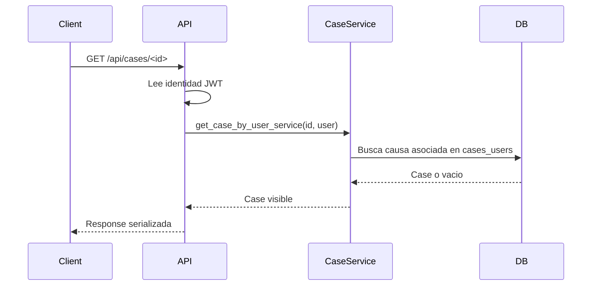

# API-004 Obtener detalle de causa por id

## Estado

Parcialmente implementado

## Objetivo

Describir el contrato tecnico para obtener el detalle basico de una causa visible para el usuario autenticado.

## Endpoint

- metodo: `GET`
- ruta: `/api/cases/<id>`

## Autenticacion

- protegida con JWT

## Request

### Params

- `id`: identificador interno de la causa

### Body

```json
{}
```

## Response esperada

### Exito

```json
{
  "id": 1,
  "rit": "C-1234-2026",
  "name": "Cobranza judicial",
  "status": "active",
  "client_id": 10,
  "created_at": "2026-07-24T23:10:00",
  "client": {
    "id": 10,
    "owner_user": "abogado@example.com",
    "name": "Empresa Demo SpA",
    "identification": "76.123.456-7",
    "email": "contacto@example.com",
    "phone_number": "+56912345678",
    "address": "Santiago",
    "notes": null,
    "status": "active",
    "created_at": "2026-07-24T23:10:00",
    "updated_at": null
  }
}
```

Si la causa no tiene cliente asociado:

```json
{
  "id": 1,
  "rit": "C-1234-2026",
  "name": "Cobranza judicial",
  "status": "active",
  "client_id": null,
  "created_at": "2026-07-24T23:10:00",
  "client": null
}
```

## Diagrama Mermaid opcional



## Errores esperados

- `400`: falta identidad de usuario autenticado en contexto
- `401`: no autenticado
- `404`: causa inexistente o no asociada al usuario autenticado
- `500`: error inesperado

## Notas tecnicas

- usa `get_jwt_identity()`
- delega en `app.services.case_service.get_case_by_user_service`
- valida ownership mediante `cases_users`
- serializa cliente asociado cuando existe
- no expone asignacion manual de cliente
- no ejecuta sincronizacion ni descarga desde Poder Judicial
- las tareas asociadas a la causa se consultan por `GET /api/tasks?case_id=<id>`

## Estado de pruebas

- Unit tests: implementado para servicio de ownership
- Integration tests: implementado para acceso autenticado y rechazo por ownership
- E2E: pendiente
