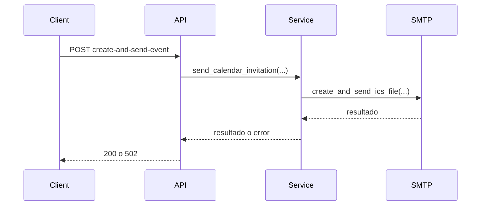

# API-001 Crear y enviar invitacion de calendario

## Estado

Borrador

## Objetivo

Describir el contrato tecnico del endpoint que genera y envia una invitacion `.ics`.

## Endpoint

- metodo: `POST`
- ruta: `/api/events/create-and-send-event`

## Autenticacion

- protegida con JWT

## Request

### Body

```json
{
  "title": "Reunion",
  "date": "01/05/2026",
  "time": "10:00",
  "location": "Sala 1",
  "recipient_email": "destinatario@example.com",
  "description": "Detalle opcional"
}
```

## Response esperada

### Exito

```json
{
  "result": "Invitacion enviada"
}
```

## Diagrama Mermaid opcional



## Errores esperados

- `400`: faltan datos requeridos
- `401`: no autenticado
- `502`: fallo al enviar la invitacion

## Notas tecnicas

- usa `app.services.event_service.send_calendar_invitation`
- el envio real depende de `app.integrations.smtp_calendar`
- tiene cobertura automatizada para validacion basica y manejo de fallo de entrega
- falta validacion manual con proveedor real configurado
