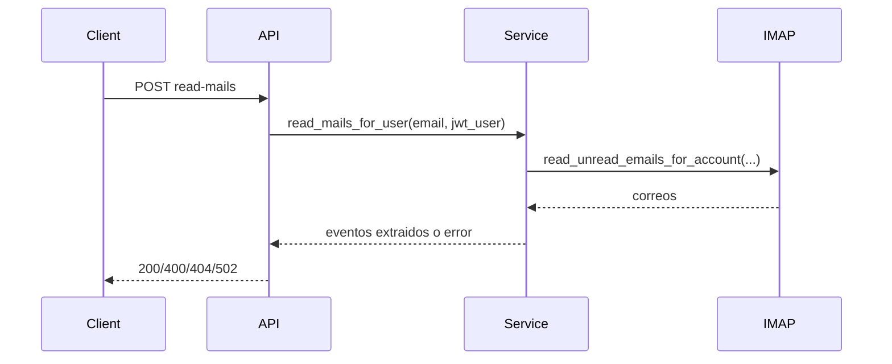

# API-001 Leer correos de una cuenta asociada

## Estado

Borrador

## Objetivo

Describir el contrato tecnico del endpoint que lee correos desde una cuenta activa del usuario y extrae posibles eventos.

## Endpoint

- metodo: `POST`
- ruta: `/api/read-mails`

## Autenticacion

- protegida con JWT

## Request

### Body

```json
{
  "email": "account@example.com"
}
```

## Response esperada

### Exito

```json
{
  "email_address": "account@example.com",
  "extracted_events": []
}
```

## Diagrama Mermaid opcional



## Errores esperados

- `400`: falta parametro `email` o falta filtro de remitente configurado
- `401`: no autenticado
- `404`: no existe cuenta activa para el usuario
- `502`: fallo de IMAP

## Notas tecnicas

- usa siempre la identidad JWT y no confia en `user` del body
- delega a `app.services.mail_service.read_mails_for_user`
- depende de cuenta IMAP activa, filtros de parametros y parser de informacion
- tiene cobertura automatizada de `401`, uso de JWT y errores principales del servicio
