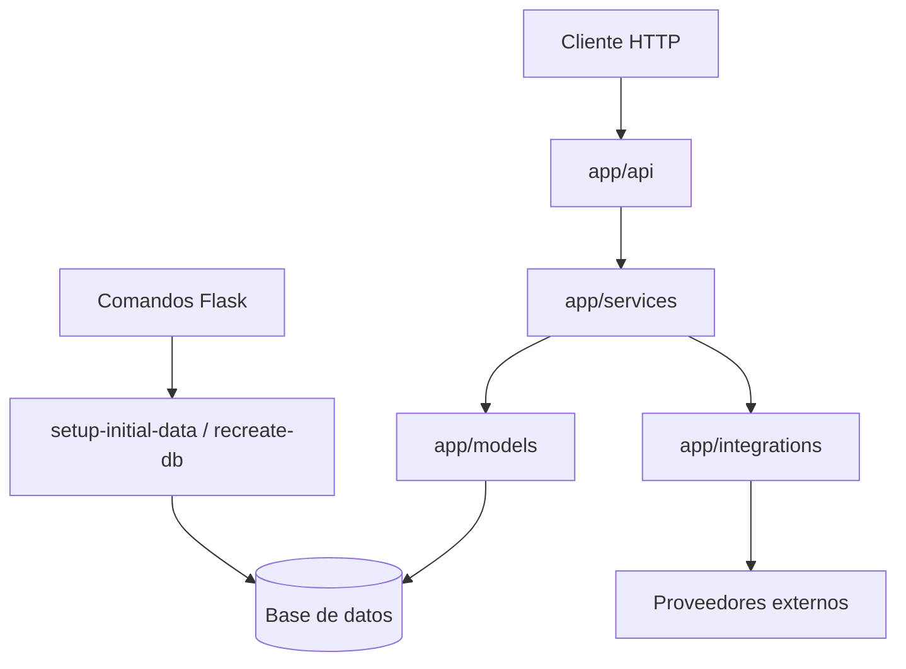

# ADR-001 Separacion de Capas y Bootstrap Explicito

## Estado

Aceptado

## Contexto

El backend arrastro durante su evolucion varios sintomas de mezcla de responsabilidades:

- blueprints con validaciones, orquestacion y detalles tecnicos de integraciones externas
- side effects de base de datos durante el arranque HTTP
- integraciones con proveedores o protocolos mezcladas con capa API o helpers difusos
- dificultad para reconstruir entornos limpios y validar cambios con pruebas automatizadas

Durante el ajuste de arquitectura del backend se avanzo en una direccion comun:

- el app factory ya no ejecuta setup operativo implicito
- el setup inicial y la recreacion completa del entorno quedaron expuestos por comandos Flask
- `auth` y otros endpoints fueron moviendo la orquestacion a `services`
- Mailjet, SMTP/iCalendar e IMAP quedaron visibles como integraciones externas en `app/integrations/`
- se agrego cobertura automatizada para auth, bootstrap y varios refactors de controller/service

Estas decisiones ya no son solo un refactor puntual; afectan como debe evolucionar el backend a futuro.

## Decision

Se adopta como decision arquitectonica estable el siguiente criterio:

1. Los blueprints en `app/api/` deben limitarse a:
- recibir request HTTP
- validar presencia o shape basico de datos de entrada
- resolver identidad/autorizacion disponible en HTTP
- invocar servicios de aplicacion
- mapear excepciones o resultados a status codes y responses

2. La capa `app/services/` debe concentrar:
- reglas de aplicacion
- ownership checks
- validaciones de dominio
- orquestacion de casos de uso
- coordinacion entre modelos e integraciones

3. La capa `app/integrations/` debe concentrar:
- detalles de proveedor externo
- protocolos como IMAP, SMTP y Mailjet
- armado de payloads o intercambio tecnico con servicios externos

4. `app/utils/` debe reservarse para helpers tecnicos acotados y no para reglas de negocio centrales ni para orquestacion de flujos.

5. El app factory no debe modificar estado operativo.
- no debe crear schema
- no debe cargar seeds
- no debe ejecutar bootstrap compartido

6. El bootstrap operativo debe resolverse mediante comandos explicitos.
- `flask --app run.py setup-initial-data`
- `flask --app run.py recreate-db --yes`

7. El backend debe soportar reconstruccion desde base vacia usando migraciones y setup explicito, sin pasos manuales implícitos durante el arranque HTTP.

## Diagrama Mermaid opcional

## Consecuencias

- mejora la trazabilidad de errores y ownership checks
- reduce mezcla de capas en controllers
- facilita pruebas unitarias y de blueprint con dobles livianos
- hace mas predecible el bootstrap de entornos locales y QA
- permite evolucionar integraciones externas sin contaminar contratos HTTP

Tradeoffs:

- requiere mas disciplina para no reintroducir logica en blueprints
- algunos endpoints legacy todavia deben alinearse por completo
- el historial de migraciones sigue siendo un punto a simplificar mas adelante aunque ya soporte recreacion desde cero

## Alternativas evaluadas

- mantener el criterio actual solo documentado en `overview.md` y `*.tasks.md`
- permitir side effects acotados en app factory para simplificar entornos locales
- dejar integraciones y orquestacion repartidas entre `api`, `services` y `utils`

Se descartan porque vuelven ambiguas decisiones que ya afectan varias areas del backend y que conviene mantener estables en el tiempo.
