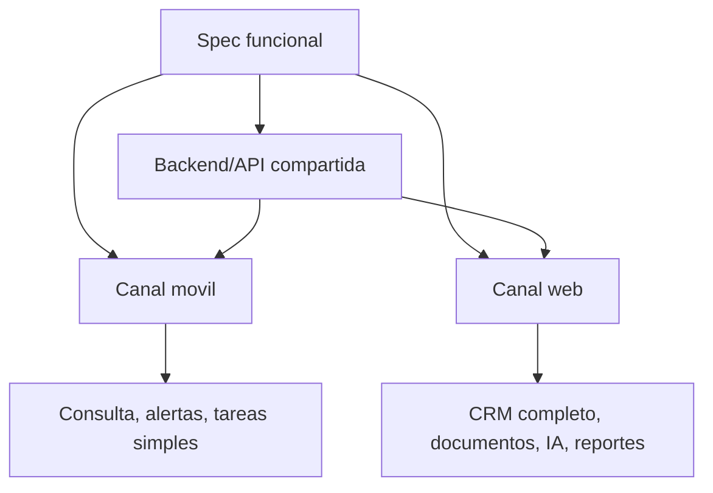

# ADR-002 Experiencia Multicanal Mobile Web

## Estado

Aceptado

## Contexto

Legalito evoluciona como plataforma CRM legal, no como una aplicacion movil aislada.

El producto contempla al menos dos canales principales:

- app movil
- web app

Algunas capacidades son naturalmente rapidas, contextuales y de consulta. Otras requieren escritorio, mayor densidad de informacion, revision documental, analisis juridico o configuracion avanzada.

Si todos los flujos se implementan primero en movil por inercia, aparecen riesgos:

- pantallas moviles demasiado cargadas
- experiencia incomoda para trabajo juridico profundo
- mezcla de funcionalidades operativas simples con flujos complejos
- specs que confunden canal de experiencia con regla de negocio
- dificultad para competir con herramientas como Case Tracker en flujos de seguimiento y analisis

## Decision

Legalito adopta un criterio multicanal para definir funcionalidades.

Cada spec funcional relevante debe distinguir, cuando aplique:

1. Backend/API
- reglas de negocio
- persistencia
- ownership/autorizacion
- integraciones
- contratos compartidos para clientes mobile y web

2. Canal movil
- consulta rapida
- alertas
- notificaciones
- revision de estado
- tareas simples
- acciones operativas de baja friccion

3. Canal web
- CRM legal completo
- gestion avanzada de clientes
- ficha extendida de causa
- seguimiento judicial/documental denso
- carga, organizacion y revision de documentos
- colaboracion IA
- analisis de jurisprudencia
- reportes
- configuracion avanzada de cuentas e integraciones

El canal movil no debe ser considerado automaticamente el destino principal de toda funcionalidad.

La web app debe ser considerada destino preferente cuando el flujo requiere:

- lectura extensa
- comparacion de informacion
- redaccion
- carga o revision documental
- analisis juridico
- configuracion avanzada
- trabajo prolongado de escritorio
- visualizacion de timeline o tableros densos

La app movil debe ser considerada destino preferente cuando el flujo requiere:

- rapidez
- movilidad
- alerta o accion inmediata
- seguimiento resumido
- confirmacion simple
- consulta de datos principales

## Diagrama Mermaid opcional

## Consecuencias

- los specs dejan de asumir que toda funcionalidad vive en la app movil
- se protege la experiencia movil de pantallas demasiado densas
- la web app queda habilitada como superficie principal para trabajo juridico profundo
- el backend se diseña como API compartida por multiples clientes
- los proximos cortes pueden separar MVP movil de experiencia web extendida
- las capacidades IA deberan especificar claramente si su primera experiencia es web, movil o ambas

Tradeoffs:

- exige definir canal objetivo antes de implementar flujos grandes
- puede generar trabajo adicional de UX/spec para separar mobile y web
- algunas funcionalidades tendran una version resumida movil y una version completa web

## Alternativas evaluadas

- implementar todo primero en movil y adaptar despues a web
- implementar todo primero en web y dejar movil solo para futuro
- no diferenciar canales dentro de los specs

Se descartan porque Legalito necesita combinar movilidad con trabajo legal profundo. El backend debe sostener ambos canales y los specs deben evitar decisiones implicitas que perjudiquen la experiencia.
