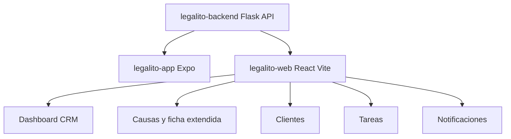

# ADR-003 Frontend Web React Vite en Repo Separado

## Estado

Aceptado

## Contexto

Legalito ya cuenta con:

- `legalito-backend`: API Flask publicada bajo `https://api.legalito.cl/api`
- `legalito-app`: app movil Expo/React Native
- `legalito-web`: web app React creada como primera superficie de escritorio CRM legal

El ADR-002 definio que Legalito debe evolucionar como experiencia multicanal y que la web app es el canal preferente para trabajo juridico profundo, vistas densas, documentos, reportes y colaboracion IA.

Durante la creacion inicial de `legalito-web` se evaluo usar Next.js. La instalacion inicial reporto vulnerabilidades de produccion transitivas asociadas al framework en la version estable disponible al momento de la implementacion. Para una primera version SPA de workspace CRM, Next.js no era estrictamente necesario.

## Decision

La primera version de `legalito-web` se implementa como repo separado usando:

- React
- Vite
- TypeScript
- ESLint
- `lucide-react` para iconografia
- CSS propio en `src/globals.css`

El repo vive en:

```txt
/Users/marcosceliz/Projects/Gescotec/legalito/legalito-web
```

La web consume la API compartida mediante:

```env
VITE_LEGALITO_API_URL=https://api.legalito.cl/api
```

La autenticacion inicial usa login contra backend y conserva la sesion en `localStorage` para este primer corte.

## Diagrama Mermaid opcional



## Consecuencias

- la web app queda desacoplada de la app movil
- se reduce complejidad inicial al evitar server rendering innecesario en este corte
- la API backend se confirma como fuente compartida para mobile y web
- se puede evolucionar UI web densa sin cargar la app movil
- el repo queda listo para despliegue estatico o hosting SPA

Tradeoffs:

- Vite SPA no resuelve server rendering ni rutas server-side por defecto
- la estrategia de sesion en `localStorage` debe revisarse antes de endurecer seguridad en produccion
- si en el futuro se requiere SSR, SEO publico o server actions, podria reevaluarse el stack web

## Alternativas evaluadas

- Next.js en repo separado
- reutilizar Expo Web desde `legalito-app`
- monorepo con frontend mobile y web juntos

Se descartan para este corte porque la prioridad es una web CRM de escritorio liviana, separada de la experiencia movil y sin dependencias con alertas de produccion en la instalacion inicial.
