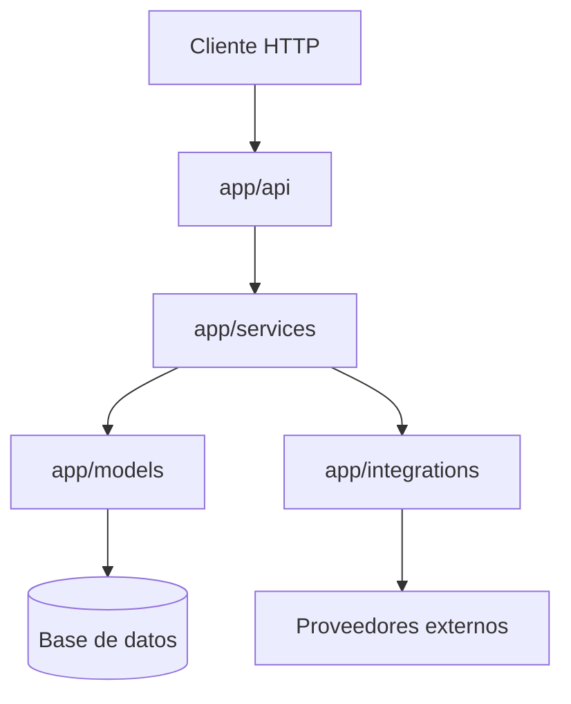

# Overview Tecnico

## Stack base

- Flask como framework HTTP
- SQLAlchemy como capa ORM
- Alembic para migraciones
- JWT para autenticacion
- Bcrypt para hashing de contraseñas

## Organizacion observada

- `app/api/`: endpoints y blueprints
- `app/services/`: logica de aplicacion
- `app/models/`: entidades persistidas
- `app/integrations/`: integraciones externas con proveedores o protocolos
- `app/utils/`: integraciones utilitarias y helpers tecnicos

## Criterio general

- los endpoints reciben y responden HTTP
- los servicios encapsulan logica de negocio u orquestacion de casos de uso
- los modelos representan persistencia
- las integraciones encapsulan detalles de proveedores externos o protocolos como Mailjet, SMTP e IMAP
- los utils deben reservarse para helpers tecnicos y no para reglas de negocio centrales

## Diagrama de capas



## Estado de estos lineamientos

Este bloque de arquitectura es una base inicial. Hasta que existan ADR o specs mas detallados, estos documentos deben leerse como guia editable y no como norma cerrada.

## Flujo de arranque y setup inicial

El app factory debe inicializar extensiones, configuracion HTTP, migraciones y blueprints sin modificar datos operativos por defecto.

El esquema de base de datos debe gestionarse con Alembic/Flask-Migrate, no con `db.create_all()` durante el arranque HTTP.

Los datos base requeridos para entornos locales o no productivos deben cargarse de forma explicita con:

```bash
flask --app run.py setup-initial-data
```

Actualmente este comando carga los estados funcionales iniciales mediante `initialize_statuses()`.

Si aparecen nuevas semillas o pasos de bootstrap compartidos, deben agregarse a un mecanismo explicito de setup y no al app factory.
