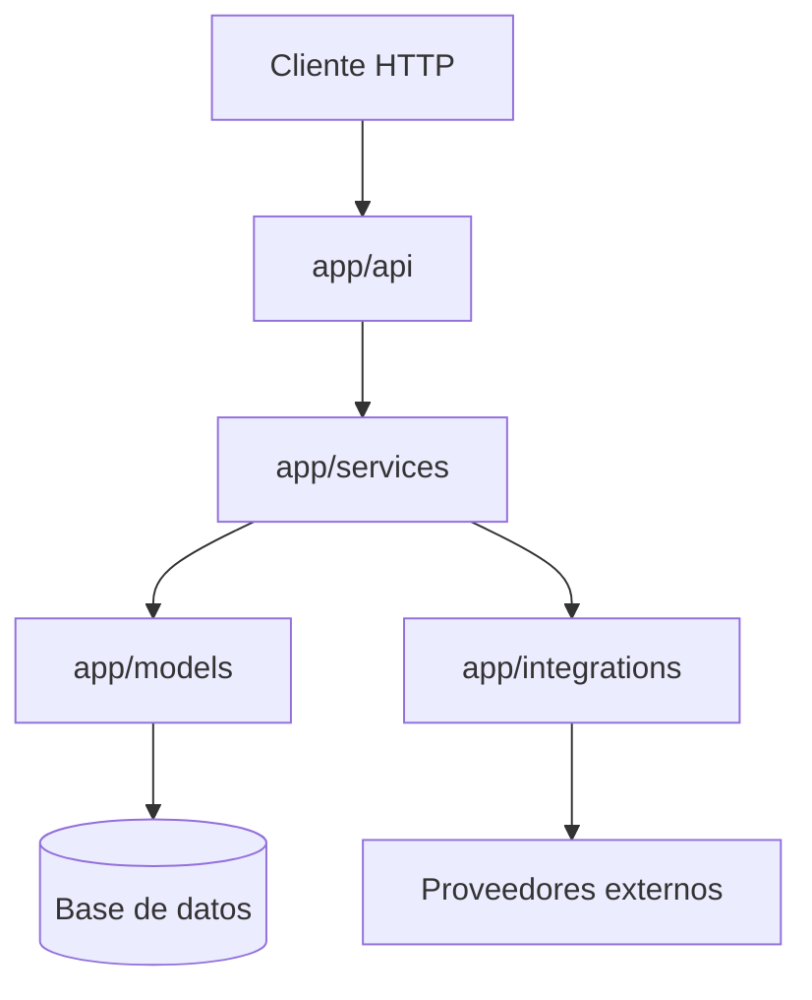

# Overview Tecnico

## Stack base

- Flask como framework HTTP
- SQLAlchemy como capa ORM
- Alembic para migraciones
- JWT para autenticacion
- Bcrypt para hashing de contraseñas

## Organizacion observada

- `app/api/`: endpoints y blueprints
- `app/services/`: logica de aplicacion
- `app/models/`: entidades persistidas
- `app/integrations/`: integraciones externas con proveedores o protocolos
- `app/utils/`: integraciones utilitarias y helpers tecnicos

## Criterio general

- los endpoints reciben y responden HTTP
- los servicios encapsulan logica de negocio u orquestacion de casos de uso
- los modelos representan persistencia
- las integraciones encapsulan detalles de proveedores externos o protocolos como Mailjet, SMTP e IMAP
- los utils deben reservarse para helpers tecnicos y no para reglas de negocio centrales

## Diagrama de capas



## Estado de estos lineamientos

Este bloque de arquitectura es una base inicial. Hasta que existan ADR o specs mas detallados, estos documentos deben leerse como guia editable y no como norma cerrada.

## Flujo de arranque y setup inicial

El app factory debe inicializar extensiones, configuracion HTTP, migraciones y blueprints sin modificar datos operativos por defecto.

El esquema de base de datos debe gestionarse con Alembic/Flask-Migrate, no con `db.create_all()` durante el arranque HTTP.

Los datos base requeridos para entornos locales o no productivos deben cargarse de forma explicita con:

```bash
flask --app run.py setup-initial-data
```

Actualmente este comando carga los estados funcionales iniciales mediante `initialize_statuses()`.

Ademas, el setup inicial debe asegurar una version minima de `terms_and_conditions` para que flujos como registro de usuario funcionen en entornos limpios.

Si aparecen nuevas semillas o pasos de bootstrap compartidos, deben agregarse a un mecanismo explicito de setup y no al app factory.

## Flujos operativos de base de datos

El backend debe soportar tres escenarios operativos simples para base de datos.

### 1. Base nueva

Se usa cuando la base existe pero no tiene esquema cargado, o cuando se apunta por primera vez a una base vacia.

Comandos:

```bash
flask --app run.py db upgrade
flask --app run.py setup-initial-data
```

Resultado esperado:

- Alembic crea todo el esquema desde cero
- el setup inicial carga datos base requeridos

### 2. Recrear todo

Se usa cuando se quiere descartar por completo el esquema actual y reconstruirlo desde cero.

Comandos:

```bash
psql "$DATABASE_URL" -c "DROP SCHEMA public CASCADE; CREATE SCHEMA public;"
flask --app run.py db upgrade
flask --app run.py setup-initial-data
```

Comando equivalente simplificado:

```bash
flask --app run.py recreate-db --yes
```

Resultado esperado:

- el esquema previo se elimina por completo
- Alembic reconstruye la base
- el setup inicial vuelve a cargar los datos base

### 3. Actualizar base existente

Se usa cuando la base ya existe y solo hace falta aplicar migraciones pendientes o reejecutar seeds idempotentes.

Comandos:

```bash
flask --app run.py db upgrade
flask --app run.py setup-initial-data
```

Resultado esperado:

- se aplican solo los cambios faltantes
- el setup inicial no debe duplicar datos base ya cargados

## Criterios esperados

- `flask --app run.py db upgrade` debe funcionar sobre una base vacia
- `flask --app run.py setup-initial-data` debe ser idempotente
- recrear el entorno completo debe resolverse sin pasos manuales fuera de `drop schema`, `upgrade` y `setup`

## Referencia operativa

Para futuras actualizaciones del servidor de QA, usar el runbook en [qa-update-runbook.md](/Users/marcosceliz/Projects/Gescotec/legalito/legalito-backend/spec/architecture/qa-update-runbook.md).
