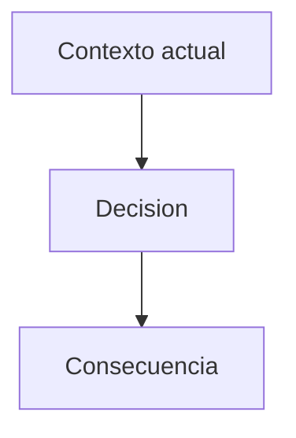

# ADR-XXX Titulo

## Estado

Propuesto

## Contexto

Problema o decision a resolver.

## Decision

Decision tomada.

## Diagrama Mermaid opcional

Usar solo si ayuda a entender dependencias, alternativas o consecuencias de la decision.

## Consecuencias

- impacto positivo
- tradeoff

## Alternativas evaluadas

- alternativa 1
- alternativa 2
