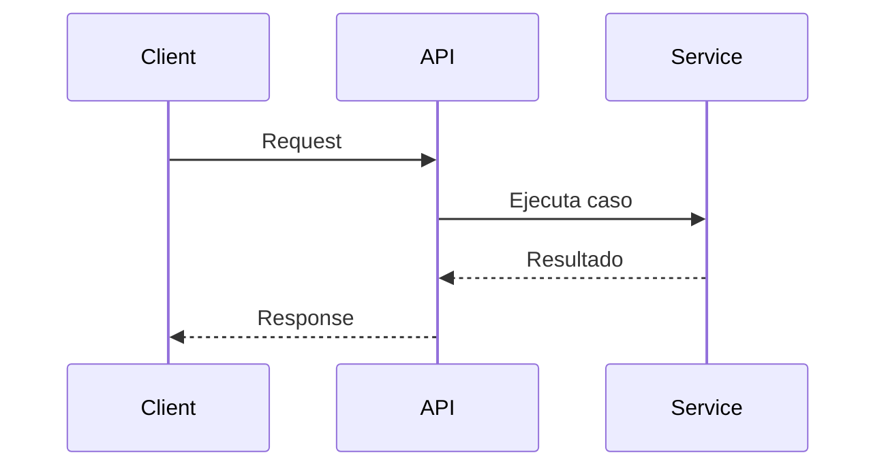

# API-XXX Nombre del endpoint

## Estado

Borrador

## Objetivo

Describir el contrato tecnico del endpoint.

## Endpoint

- metodo: `POST`
- ruta: `/api/...`

## Autenticacion

- publica o protegida

## Request

### Body

```json
{}
```

## Response esperada

### Exito

```json
{}
```

## Diagrama Mermaid opcional

Usar solo si el endpoint orquesta servicios, persistencia o integraciones externas.



## Errores esperados

- `400`: validacion
- `401`: no autenticado
- `403`: no autorizado
- `404`: no encontrado

## Notas tecnicas

- dependencia externa
- persistencia afectada
