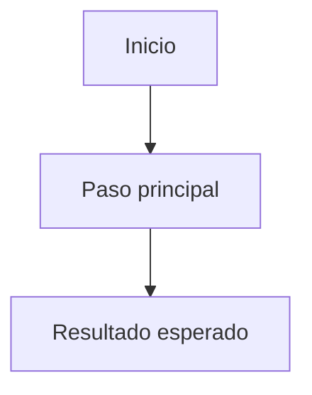

# UC-XXX Nombre del caso de uso

## Estado

Borrador

## Objetivo

Describir el resultado de negocio esperado.

## Actores

- actor principal
- actor secundario

## Disparador

Evento que inicia el flujo.

## Precondiciones

- condicion 1

## Flujo principal

1. paso 1
2. paso 2
3. paso 3

## Diagrama Mermaid opcional

Usar solo si aclara el flujo, estados o caminos alternativos.

## Flujos alternativos

- alternativa 1

## Reglas de negocio

- regla 1

## Postcondiciones

- resultado esperado

## Criterios de aceptacion

- criterio 1
