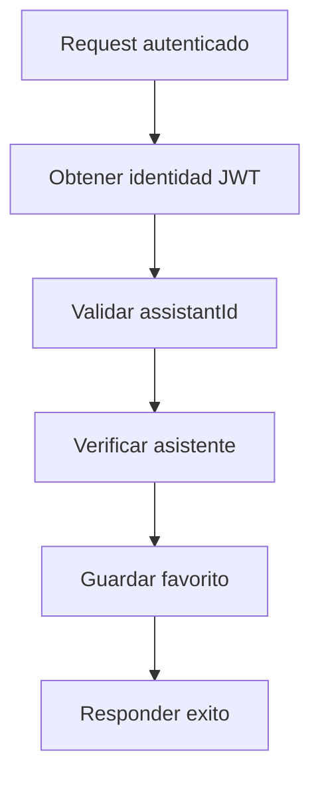

# UC-001 Guardar asistente favorito

## Estado

Borrador

## Objetivo

Permitir que un usuario autenticado marque un asistente como favorito.

## Actores

- usuario autenticado
- backend de asistentes

## Disparador

El usuario solicita agregar un asistente a su lista de favoritos.

## Precondiciones

- el usuario esta autenticado
- el asistente existe

## Flujo principal

1. El usuario solicita guardar un asistente favorito.
2. El backend obtiene la identidad desde JWT.
3. El backend valida que se haya informado `assistantId`.
4. El backend verifica que el asistente exista.
5. El backend crea la relacion de favorito para el usuario.
6. El backend responde confirmacion.

## Diagrama Mermaid opcional

## Flujos alternativos

- Si falta `assistantId`, el flujo se rechaza por validacion.
- Si el asistente no existe, el flujo se rechaza como no encontrado.
- Si la relacion ya existe, el backend puede considerar el resultado como idempotente.

## Reglas de negocio

- la identidad del usuario debe salir del JWT
- no debe confiarse en un `user` enviado por request
- un favorito pertenece a la dupla `assistant_id` + `user`

## Postcondiciones

- el asistente queda asociado como favorito del usuario

## Criterios de aceptacion

- dado un usuario autenticado y un asistente existente, cuando solicita agregarlo a favoritos, entonces la relacion queda guardada
- dado un request sin `assistantId`, cuando intenta guardar favorito, entonces el flujo responde error de validacion
- dado un request con `user` forjado, cuando existe JWT valido, entonces el backend usa la identidad autenticada
