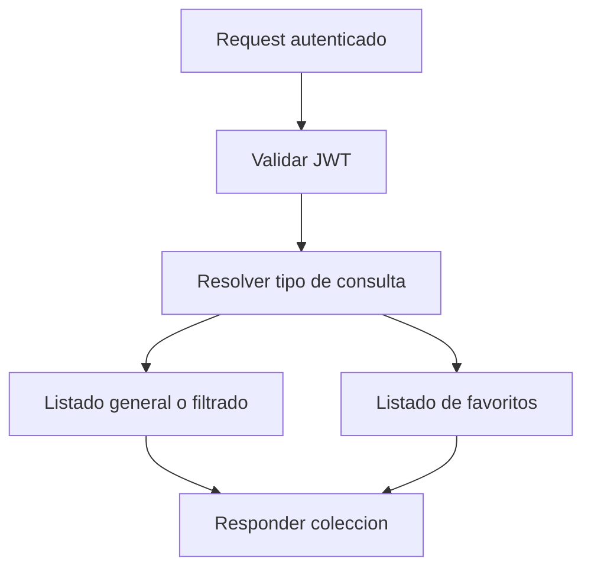

# UC-002 Consultar asistentes y favoritos

## Estado

Borrador

## Objetivo

Permitir que un usuario autenticado explore asistentes, aplique filtros y consulte su lista de favoritos.

## Actores

- usuario autenticado
- backend de asistentes

## Disparador

El usuario solicita listado general, filtrado o favoritos de asistentes.

## Precondiciones

- el usuario esta autenticado

## Flujo principal

1. El usuario solicita ver asistentes o favoritos.
2. El backend valida la autenticacion.
3. El backend obtiene la identidad del usuario si el flujo requiere favoritos.
4. El backend consulta asistentes generales, filtrados o favoritos segun corresponda.
5. El backend responde la coleccion resultante.

## Diagrama Mermaid opcional

## Flujos alternativos

- Si el request no esta autenticado, el flujo se rechaza.
- Si no hay resultados, el backend responde una lista vacia.

## Reglas de negocio

- la lista de favoritos debe resolverse usando la identidad del JWT
- los filtros permiten `0` como comodin para tipo o region

## Postcondiciones

- el usuario recibe la coleccion de asistentes correspondiente a su consulta

## Criterios de aceptacion

- dado un usuario autenticado, cuando consulta asistentes, entonces recibe la lista serializada
- dado un usuario autenticado, cuando consulta favoritos, entonces recibe solo sus favoritos
- dado un request con `user` forjado, cuando se consulta favoritos con JWT valido, entonces el backend usa la identidad autenticada
