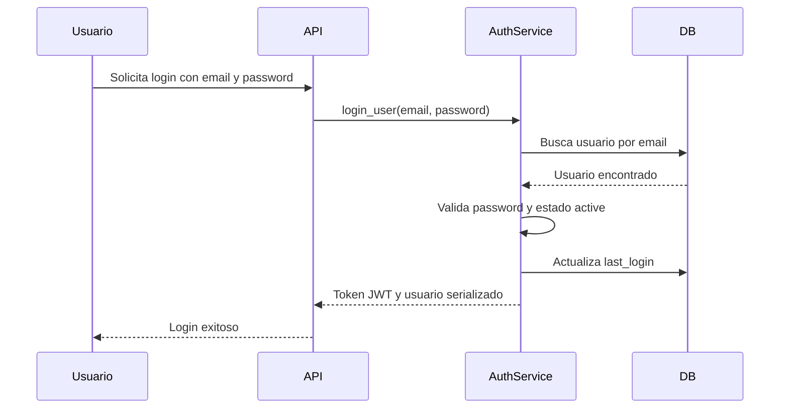

# UC-001 Autenticacion de usuario

## Estado

Borrador

## Objetivo

Permitir que un usuario registrado y activo obtenga una sesion autenticada para operar en la plataforma.

## Actores

- usuario no autenticado
- backend de autenticacion

## Disparador

El usuario envia sus credenciales para iniciar sesion.

## Precondiciones

- el usuario existe en el sistema
- el usuario tiene contraseña registrada
- el usuario tiene estado funcional `active`

## Flujo principal

1. El usuario informa email y contraseña.
2. El backend busca el usuario por email.
3. El backend valida que la contraseña informada coincida con la contraseña almacenada.
4. El backend valida que la cuenta tenga estado `active`.
5. El backend registra la fecha de ultimo login.
6. El backend genera un token de acceso JWT para el usuario.
7. El backend entrega el token de acceso y los datos serializados del usuario.

## Diagrama Mermaid opcional

## Flujos alternativos

- Si no se informa email o contraseña, el flujo se rechaza por datos requeridos faltantes.
- Si el email no corresponde a un usuario existente, el flujo se rechaza como credenciales invalidas.
- Si la contraseña no coincide, el flujo se rechaza como credenciales invalidas.
- Si la cuenta existe pero no tiene estado `active`, el flujo se rechaza por cuenta inactiva.
- Si ocurre un error inesperado, el flujo se rechaza como error interno.

## Reglas de negocio

- Solo usuarios con estado funcional `active` pueden iniciar sesion.
- La contraseña nunca debe compararse ni exponerse en texto plano.
- El usuario autenticado recibe un JWT cuyo `identity` corresponde al identificador persistido del usuario.
- El login exitoso debe actualizar `last_login`.
- El backend debe aplicar un rate limiting minimo a `login`, `forgot-password` y `reset-password` para reducir abuso automatizado.
- La respuesta de usuario no debe exponer `password_hash`, `reset_code` ni expiracion del codigo de recuperacion.

## Postcondiciones

- En caso exitoso, el usuario obtiene un token de acceso.
- En caso exitoso, el usuario queda con `last_login` actualizado.
- En caso fallido, no se genera token de acceso.

## Criterios de aceptacion

- Dado un usuario activo con credenciales validas, cuando solicita iniciar sesion, entonces recibe token de acceso y datos de usuario.
- Dado un email inexistente, cuando solicita iniciar sesion, entonces recibe rechazo por credenciales invalidas.
- Dado un usuario existente con contraseña incorrecta, cuando solicita iniciar sesion, entonces recibe rechazo por credenciales invalidas.
- Dado un usuario existente sin estado `active`, cuando solicita iniciar sesion, entonces recibe rechazo por cuenta inactiva.
- Dado multiples intentos consecutivos sobre `login` o recuperacion de contraseña dentro de la misma ventana, cuando supera el limite configurado, entonces recibe `429`.
- Dado un login exitoso, cuando se serializa el usuario, entonces no se exponen datos sensibles de contraseña o recuperacion.

## Estado de pruebas

- Unit tests: parcial
- Integration tests: pendiente
- E2E: pendiente

## Cobertura actual

- `auth_service.login_user` cubre login exitoso, credenciales invalidas y cuenta inactiva.
- `auth_service.request_password_reset` cubre usuario existente, usuario inexistente y fallo de entrega de correo.
- `auth_service.reset_password_with_code` cubre caso exitoso, codigo invalido y codigo expirado.
- `app/api/auth.py` cubre mapeo HTTP basico para login, register, forgot-password y reset-password, incluido `429` por rate limiting.
