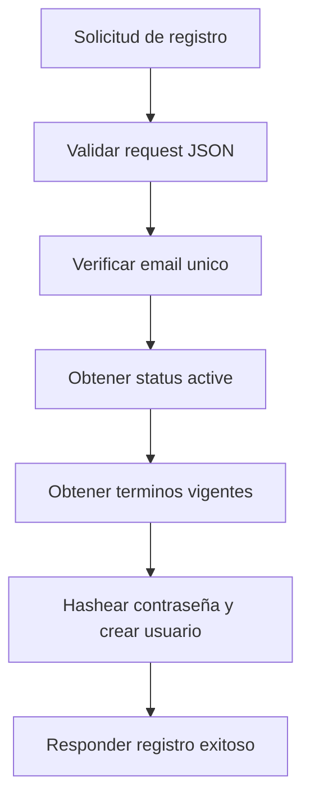

# UC-002 Registro de usuario

## Estado

Vigente con validacion tecnica y validacion manual parcial

## Objetivo

Permitir que una persona cree una cuenta nueva y quede habilitada para autenticarse en la plataforma.

## Actores

- usuario no autenticado
- backend de registro

## Disparador

El usuario envia email, contraseña y datos basicos para registrarse.

## Precondiciones

- el email no existe previamente en el sistema
- existe el estado funcional `active`
- existe una version vigente de `terms_and_conditions`

## Flujo principal

1. El usuario informa email, contraseña, nombre y apellido.
2. El backend valida que el request sea JSON.
3. El backend verifica que el email no exista previamente.
4. El backend obtiene el estado funcional `active`.
5. El backend obtiene la version vigente de `terms_and_conditions`.
6. El backend hashea la contraseña.
7. El backend crea el usuario con estado activo y referencia a los terminos vigentes.
8. El backend responde con los datos basicos del usuario registrado.

## Diagrama Mermaid opcional

## Flujos alternativos

- Si el request no es JSON, el flujo se rechaza.
- Si faltan email o contraseña, el flujo se rechaza por datos requeridos faltantes.
- Si el email ya existe, el flujo se rechaza por conflicto.
- Si no existe el estado `active`, el flujo se rechaza por error de configuracion.
- Si no existen terminos vigentes, el flujo se rechaza por error de configuracion.

## Reglas de negocio

- el email debe ser unico
- la contraseña nunca debe persistirse en texto plano
- el usuario nuevo queda asociado a la version vigente de `terms_and_conditions`
- el usuario nuevo queda activo al momento del registro

## Postcondiciones

- en caso exitoso, el usuario queda persistido y listo para iniciar sesion
- en caso fallido, no debe persistirse un usuario parcial

## Criterios de aceptacion

- dado un email nuevo y datos validos, cuando se solicita registro, entonces el usuario se crea con estado `active`
- dado un email ya registrado, cuando se solicita registro, entonces el flujo responde conflicto
- dado un entorno limpio con seed inicial correcto, cuando se solicita registro, entonces el flujo funciona sin insertar terminos manualmente
