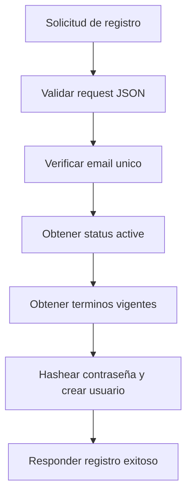

# UC-002 Registro de usuario

## Estado

Vigente con validacion tecnica y validacion manual parcial

## Objetivo

Permitir que una persona cree una cuenta nueva y quede habilitada para autenticarse en la plataforma.

## Actores

- usuario no autenticado
- backend de registro

## Disparador

El usuario envia email, contraseña, datos basicos, el `terms_id`, la `terms_version` de la version visible en pantalla y una confirmacion explicita de aceptacion para registrarse.

## Precondiciones

- el email no existe previamente en el sistema
- existe el estado funcional `active`
- existe una version vigente de `terms_and_conditions`
- el cliente conoce el `terms_id` vigente a partir de la consulta publica de terminos
- el cliente conoce la `terms_version` vigente a partir de la consulta publica de terminos
- el cliente informa aceptacion explicita de esos terminos

## Flujo principal

1. El usuario informa email, contraseña, nombre, apellido, `terms_id`, `terms_version` y `accepted_terms`.
2. El backend valida que el request sea JSON.
3. El backend verifica que el email no exista previamente.
4. El backend obtiene el estado funcional `active`.
5. El backend obtiene la version vigente de `terms_and_conditions`.
6. El backend valida que el `terms_id` recibido coincida con la version vigente.
7. El backend valida que la `terms_version` recibida coincida con la version vigente.
8. El backend valida que `accepted_terms` sea `true`.
9. El backend hashea la contraseña.
10. El backend crea el usuario con estado activo y referencia a los terminos vigentes.
11. El backend responde con los datos basicos del usuario registrado.

## Diagrama Mermaid opcional

## Flujos alternativos

- Si el request no es JSON, el flujo se rechaza.
- Si faltan email, contraseña, `terms_id`, `terms_version` o `accepted_terms`, el flujo se rechaza por datos requeridos faltantes.
- Si el email ya existe, el flujo se rechaza por conflicto.
- Si no existe el estado `active`, el flujo se rechaza por error de configuracion.
- Si no existen terminos vigentes, el flujo se rechaza por error de configuracion.
- Si `terms_id` no coincide con la version vigente, el flujo se rechaza por conflicto.
- Si `terms_version` no coincide con la version vigente, el flujo se rechaza por conflicto.
- Si `accepted_terms` no es `true`, el flujo se rechaza por validacion.

## Reglas de negocio

- el email debe ser unico
- la contraseña nunca debe persistirse en texto plano
- el cliente debe informar el `terms_id` que el usuario acepto durante el registro
- el cliente debe informar la `terms_version` que el usuario vio y acepto durante el registro
- el cliente debe confirmar explicitamente la aceptacion mediante `accepted_terms=true`
- el backend solo registra al usuario si `terms_id` y `terms_version` coinciden con la version vigente
- el usuario nuevo queda asociado a la version vigente de `terms_and_conditions`
- el usuario nuevo queda activo al momento del registro

## Postcondiciones

- en caso exitoso, el usuario queda persistido y listo para iniciar sesion
- en caso fallido, no debe persistirse un usuario parcial

## Criterios de aceptacion

- dado un email nuevo y datos validos, cuando se solicita registro, entonces el usuario se crea con estado `active`
- dado un email ya registrado, cuando se solicita registro, entonces el flujo responde conflicto
- dado un `terms_id` desactualizado o incorrecto, cuando se solicita registro, entonces el flujo responde conflicto
- dado una `terms_version` desactualizada o incorrecta, cuando se solicita registro, entonces el flujo responde conflicto
- dado `accepted_terms=false`, cuando se solicita registro, entonces el flujo responde error de validacion
- dado un entorno limpio con seed inicial correcto, cuando se solicita registro, entonces el flujo funciona sin insertar terminos manualmente
