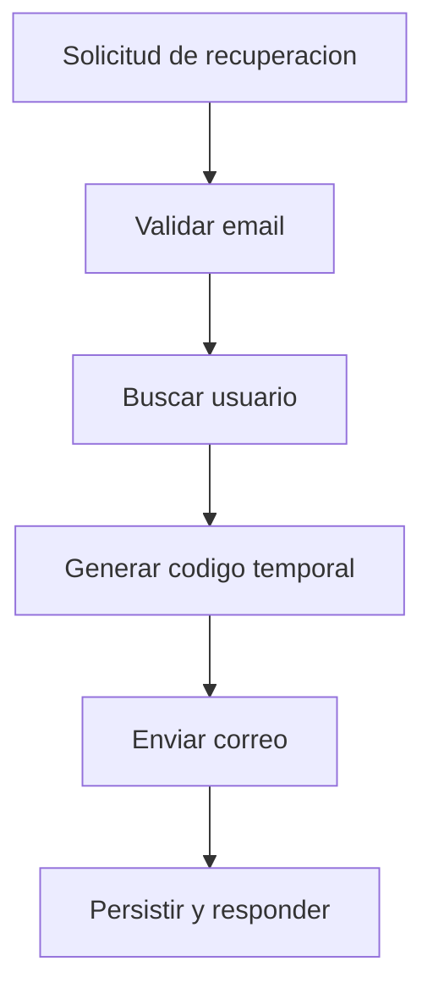

# UC-003 Solicitud de recuperacion de contraseña

## Estado

Vigente con validacion tecnica y validacion manual parcial

## Objetivo

Permitir que un usuario existente solicite un codigo temporal para recuperar su contraseña.

## Actores

- usuario no autenticado
- backend de autenticacion
- proveedor de envio de correo

## Disparador

El usuario informa su email para recuperar la contraseña.

## Precondiciones

- el usuario existe en el sistema
- existe un proveedor de envio configurado

## Flujo principal

1. El usuario informa su email.
2. El backend valida que el email fue enviado.
3. El backend busca el usuario por email.
4. El backend genera un codigo temporal de 6 digitos.
5. El backend asigna el codigo y su expiracion al usuario.
6. El backend solicita al proveedor de correo el envio del codigo.
7. Si el envio es exitoso, el backend persiste el codigo y responde confirmacion.

## Diagrama Mermaid opcional

## Flujos alternativos

- Si falta el email, el flujo se rechaza por datos requeridos faltantes.
- Si el usuario no existe, el flujo se rechaza como no encontrado.
- Si se excede el rate limiting, el flujo se rechaza con `429`.
- Si falla el proveedor de correo, el flujo se rechaza con error de entrega y no debe persistirse el codigo.

## Reglas de negocio

- el codigo temporal tiene 6 digitos
- el backend debe aplicar rate limiting al flujo
- no debe responder exito si el proveedor de correo falla
- el flujo depende de un proveedor de envio funcional

## Postcondiciones

- en caso exitoso, el usuario queda con codigo temporal vigente
- en caso fallido por proveedor, el usuario no debe quedar con codigo persistido por ese intento

## Criterios de aceptacion

- dado un usuario existente, cuando solicita recuperacion, entonces recibe confirmacion y el codigo queda vigente
- dado un usuario inexistente, cuando solicita recuperacion, entonces recibe no encontrado
- dado un fallo del proveedor de envio, cuando solicita recuperacion, entonces el flujo responde error explicito y no falso exito
- dado muchos intentos consecutivos, cuando supera el limite configurado, entonces recibe `429`
