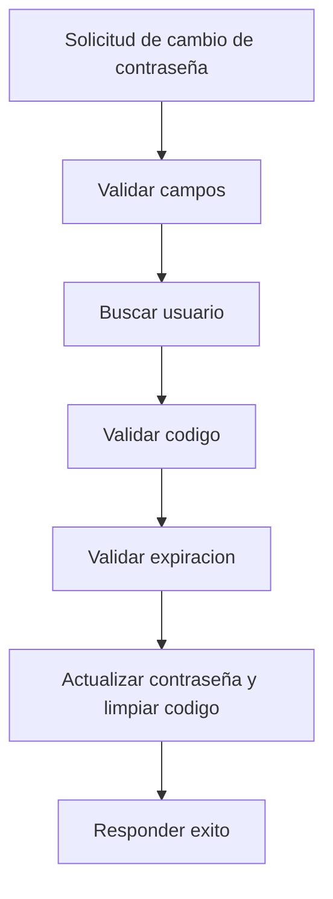

# UC-004 Restablecimiento de contraseña con codigo

## Estado

Vigente con validacion tecnica

## Objetivo

Permitir que un usuario cambie su contraseña usando un codigo temporal previamente emitido.

## Actores

- usuario no autenticado
- backend de autenticacion

## Disparador

El usuario informa email, codigo temporal y nueva contraseña.

## Precondiciones

- el usuario existe en el sistema
- el usuario tiene un codigo temporal emitido
- el codigo aun no expiro

## Flujo principal

1. El usuario informa email, codigo temporal y nueva contraseña.
2. El backend valida que todos los campos requeridos esten presentes.
3. El backend busca el usuario por email.
4. El backend valida que el codigo coincida.
5. El backend valida que el codigo no este expirado.
6. El backend hashea la nueva contraseña.
7. El backend limpia el codigo temporal y su expiracion.
8. El backend actualiza la contraseña y responde confirmacion.

## Diagrama Mermaid opcional

## Flujos alternativos

- Si faltan campos requeridos, el flujo se rechaza.
- Si el usuario no existe, el flujo se rechaza como no encontrado.
- Si el codigo no coincide, el flujo se rechaza como invalido.
- Si el codigo expiro, el flujo se rechaza por expiracion.
- Si se excede el rate limiting, el flujo se rechaza con `429`.

## Reglas de negocio

- la nueva contraseña nunca debe persistirse en texto plano
- el codigo debe invalidarse luego de un cambio exitoso
- el backend debe aplicar rate limiting al flujo

## Postcondiciones

- en caso exitoso, la contraseña queda actualizada
- en caso exitoso, el codigo temporal queda invalidado
- en caso fallido, la contraseña no cambia

## Criterios de aceptacion

- dado un codigo valido y vigente, cuando el usuario informa nueva contraseña, entonces la contraseña se actualiza
- dado un codigo invalido, cuando el usuario intenta cambiar la contraseña, entonces el flujo se rechaza
- dado un codigo expirado, cuando el usuario intenta cambiar la contraseña, entonces el flujo se rechaza por expiracion
- dado muchos intentos consecutivos, cuando supera el limite configurado, entonces recibe `429`
