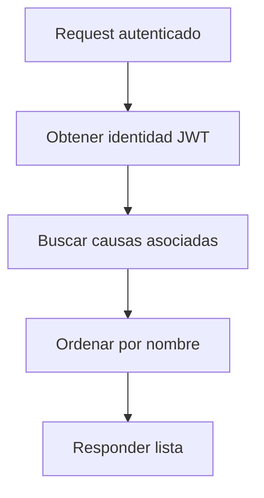

# UC-001 Listar causas por usuario

## Estado

Borrador

## Objetivo

Permitir que un usuario autenticado vea las causas asociadas a su identidad.

## Actores

- usuario autenticado
- backend de causas

## Disparador

El usuario solicita ver sus causas.

## Precondiciones

- el usuario esta autenticado
- existen asociaciones entre usuario y causa en `cases_users`

## Flujo principal

1. El usuario solicita listar sus causas.
2. El backend obtiene la identidad desde JWT.
3. El backend busca las causas asociadas al usuario.
4. El backend ordena las causas por nombre.
5. El backend responde la lista serializada.

## Diagrama Mermaid opcional

## Flujos alternativos

- Si no existe identidad autenticada, el flujo se rechaza.
- Si el usuario no tiene causas asociadas, el backend responde una lista vacia.

## Reglas de negocio

- la identidad debe salir del JWT y no del body
- la respuesta debe incluir solo causas asociadas al usuario autenticado

## Postcondiciones

- el usuario obtiene una lista de sus causas

## Criterios de aceptacion

- dado un usuario autenticado con causas asociadas, cuando solicita listarlas, entonces recibe solo sus causas
- dado un request sin autenticacion, cuando intenta listar causas, entonces el flujo se rechaza
- dado un body con `user` forjado, cuando existe JWT valido, entonces el backend ignora el valor forjado
