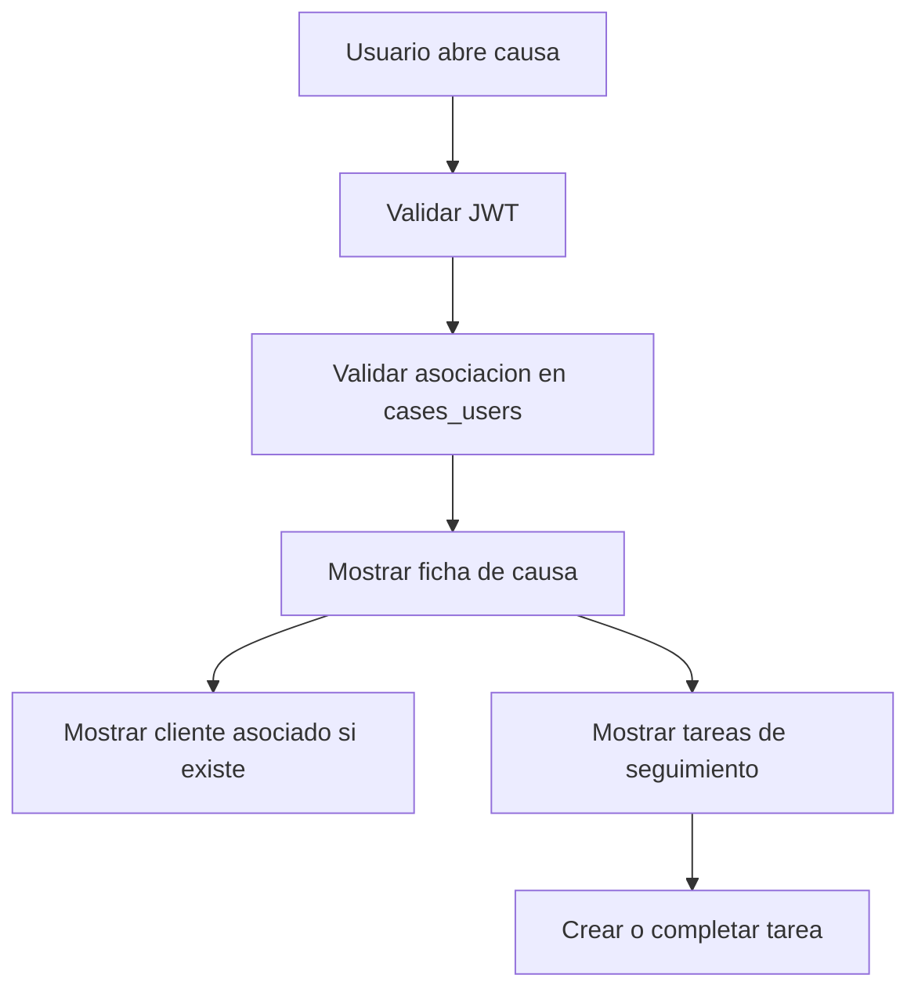

# UC-002 Ficha de causa y seguimiento operativo

## Estado

Borrador

## Objetivo

Permitir que un usuario autenticado consulte una ficha de causa como unidad central de trabajo del CRM legal, reuniendo datos basicos de la causa, cliente asociado cuando exista, tareas operativas y señales de seguimiento disponibles.

## Actores

- usuario autenticado
- backend de causas
- backend de tareas
- backend de notificaciones
- integraciones futuras con Poder Judicial

## Disparador

El usuario selecciona una causa desde el listado o desde una notificacion procesada.

## Precondiciones

- el usuario esta autenticado
- la causa existe en Legalito
- la causa esta asociada al usuario por `cases_users`
- si existe cliente asociado, la relacion proviene de datos conocidos por Legalito, no de asignacion manual en esta ficha

## Flujo principal

1. El usuario abre el detalle de una causa.
2. El backend obtiene la identidad desde JWT.
3. El backend valida que la causa este asociada al usuario autenticado.
4. El backend responde los datos principales de la causa.
5. La experiencia presenta el cliente asociado cuando exista.
6. La experiencia presenta tareas vinculadas a la causa.
7. La experiencia permite crear nuevas tareas operativas vinculadas a la causa.
8. La experiencia permite completar tareas pendientes sin modificar la informacion judicial base de la causa.

## Diagrama Mermaid opcional

## Flujos alternativos

- Si el request no esta autenticado, el flujo se rechaza.
- Si la causa no existe o no pertenece al usuario, el backend responde como no encontrada.
- Si no hay cliente asociado, la ficha debe indicar ausencia de cliente sin pedir asignacion manual.
- Si no hay tareas asociadas, la ficha debe permitir operar con lista vacia.
- Si las integraciones judiciales aun no entregan movimientos, la ficha puede mostrar datos dummy o secciones pendientes sin bloquear el resto de la gestion.

## Reglas de negocio

- la identidad del usuario debe obtenerse desde JWT
- la causa solo es visible si esta asociada al usuario autenticado
- la ficha no debe permitir asignar manualmente cliente a la causa en este corte
- la ficha no debe crear causas manualmente como parte del flujo de detalle
- la informacion proveniente del Poder Judicial queda fuera del alcance de este corte
- las tareas creadas desde la ficha deben quedar vinculadas a `case_id`
- completar tareas no altera la causa ni elimina informacion historica
- cualquier capacidad futura de IA sobre la ficha debe respetar confidencialidad, revision humana y trazabilidad

## Canales de experiencia

### Backend/API

- debe exponer datos de causa con validacion de ownership
- debe permitir consultar tareas asociadas por `case_id`
- debe permitir crear y completar tareas vinculadas a la causa
- debe mantenerse como contrato compartido para app movil y web app

### App movil

- debe priorizar una ficha resumida de causa
- debe permitir consulta rapida de estado, cliente asociado y tareas pendientes
- debe permitir crear y completar tareas simples
- debe mostrar señales de seguimiento sin saturar la pantalla
- no debe incorporar flujos densos de analisis documental o jurisprudencial en este corte

### Web app

- debe considerarse destino preferente para ficha extendida de causa
- debe alojar timeline judicial/documental completo cuando se implemente
- debe alojar carga, revision y organizacion de documentos
- debe alojar analisis IA de caso, jurisprudencia y antecedentes
- debe alojar reportes y vistas comparativas de seguimiento

## Postcondiciones

- el usuario obtiene una vista centralizada de la causa
- las tareas creadas desde la ficha quedan asociadas a la causa
- la causa mantiene su relacion judicial y de cliente sin cambios manuales desde este flujo

## Criterios de aceptacion

- dado un usuario autenticado con una causa asociada, cuando abre la ficha, entonces ve solo esa causa si le pertenece
- dado un usuario autenticado sin asociacion a la causa, cuando intenta abrirla, entonces no obtiene informacion de la causa
- dado una causa sin cliente asociado, cuando se muestra la ficha, entonces no se exige asignacion manual de cliente
- dado una causa con tareas asociadas, cuando se muestra la ficha, entonces se listan las tareas de esa causa
- dado un titulo valido, cuando se crea una tarea desde la ficha, entonces la tarea queda asociada a la causa
- dado una tarea pendiente de la causa, cuando se completa, entonces queda marcada como completada

## Alcance fuera de este corte

- sincronizacion directa con Poder Judicial
- descarga automatica de detalle judicial desde Poder Judicial
- asignacion manual de cliente a causa
- analisis IA de jurisprudencia o documentos
- timeline judicial completo con movimientos normalizados
