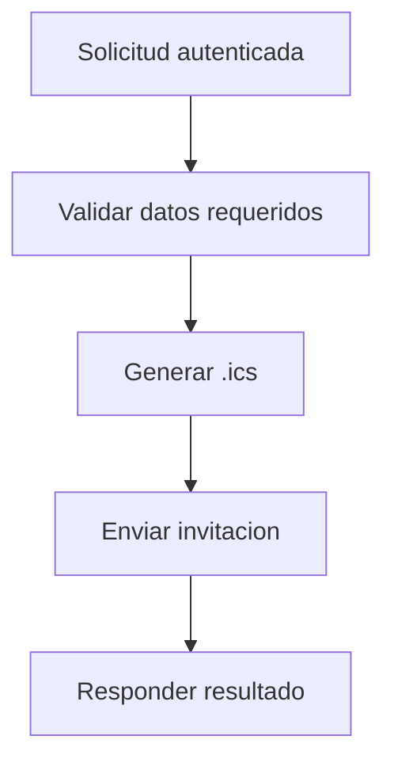

# UC-001 Enviar invitacion de calendario

## Estado

Borrador

## Objetivo

Permitir que el sistema genere y envie una invitacion de calendario `.ics` a un destinatario indicado.

## Actores

- usuario autenticado
- backend de eventos
- servicio de envio SMTP/iCalendar

## Disparador

El usuario solicita crear y enviar una invitacion de calendario.

## Precondiciones

- el usuario esta autenticado
- se informan titulo, fecha, hora y destinatario

## Flujo principal

1. El usuario envia los datos de la invitacion.
2. El backend valida campos requeridos.
3. El backend genera el contenido `.ics`.
4. El backend intenta enviar la invitacion al destinatario.
5. El backend responde el resultado del envio.

## Diagrama Mermaid opcional

## Flujos alternativos

- Si faltan datos requeridos, el flujo se rechaza por validacion.
- Si falla el envio del `.ics`, el flujo se rechaza como error de entrega.

## Reglas de negocio

- la invitacion requiere al menos `title`, `date`, `time` y `recipient_email`
- el backend no debe responder falso exito cuando falla la entrega

## Postcondiciones

- en caso exitoso, la invitacion fue generada e intentada enviar
- en caso fallido, el usuario recibe error explicito

## Criterios de aceptacion

- dado un request valido, cuando el proveedor responde correctamente, entonces el endpoint devuelve exito
- dado un request sin datos requeridos, cuando se procesa, entonces el flujo devuelve error de validacion
- dado un fallo del proveedor de envio, cuando se procesa la invitacion, entonces el flujo devuelve error de entrega
