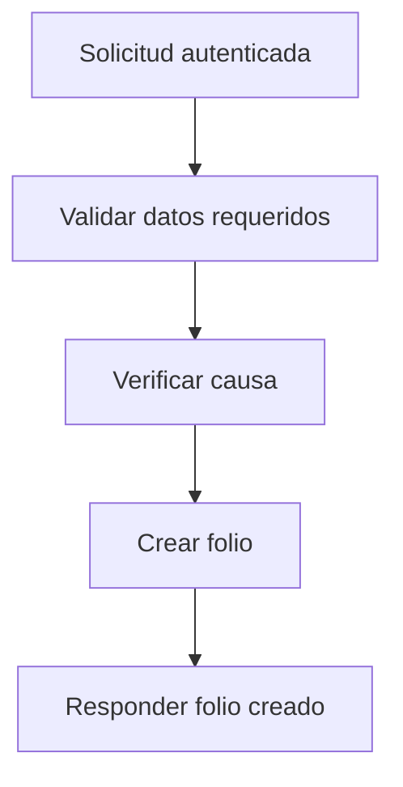

# UC-001 Crear folio para causa

## Estado

Borrador

## Objetivo

Permitir crear un folio asociado a una causa existente.

## Actores

- usuario autenticado
- backend de folios

## Disparador

El usuario solicita crear un folio para una causa.

## Precondiciones

- el usuario esta autenticado
- la causa asociada existe
- se informa un numero de folio

## Flujo principal

1. El usuario envia `case_id`, `folio_number` y descripcion opcional.
2. El backend valida los campos requeridos.
3. El backend verifica que la causa exista.
4. El backend crea el folio asociado.
5. El backend responde el folio creado.

## Diagrama Mermaid opcional

## Flujos alternativos

- Si faltan `case_id` o `folio_number`, el flujo se rechaza por validacion.
- Si la causa no existe, el flujo se rechaza.

## Reglas de negocio

- un folio siempre debe pertenecer a una causa existente
- el numero de folio es obligatorio

## Postcondiciones

- en caso exitoso, el folio queda persistido y asociado a la causa

## Criterios de aceptacion

- dado un request valido con una causa existente, cuando se solicita crear el folio, entonces este queda persistido
- dado un `case_id` inexistente, cuando se solicita crear el folio, entonces el flujo responde error explicito
