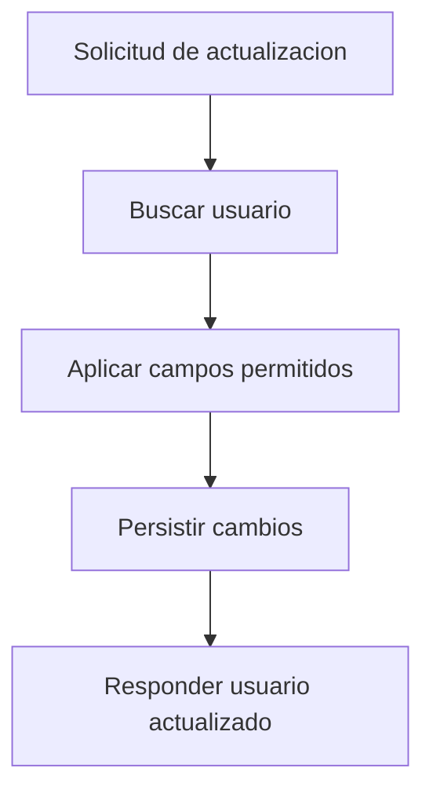

# UC-001 Actualizar perfil de usuario

## Estado

Borrador

## Objetivo

Permitir actualizar datos basicos del perfil de un usuario existente.

## Actores

- usuario autenticado o actor administrativo
- backend de usuarios

## Disparador

Se solicita una actualizacion sobre un usuario identificado por `user`.

## Precondiciones

- el usuario objetivo existe
- la solicitud contiene al menos un campo actualizable

## Flujo principal

1. El cliente envia datos a actualizar.
2. El backend busca el usuario objetivo.
3. El backend actualiza solo los campos permitidos.
4. El backend persiste los cambios.
5. El backend responde el usuario actualizado.

## Diagrama Mermaid opcional

## Flujos alternativos

- Si el usuario no existe, el flujo se rechaza con error de no encontrado.
- Si la imagen no puede procesarse, el flujo se rechaza con error de validacion.

## Reglas de negocio

- solo se actualizan campos permitidos
- `birth_date` debe parsearse como fecha valida
- si se recibe `image_base64`, el backend intenta reemplazar la imagen actual

## Postcondiciones

- el usuario queda actualizado
- `updated_at` refleja la ultima modificacion

## Criterios de aceptacion

- dado un usuario existente, cuando se envian campos validos, entonces se persisten los cambios
- dado un usuario inexistente, cuando se solicita actualizarlo, entonces el flujo responde no encontrado
- dado un error al procesar imagen, cuando se intenta actualizarla, entonces el flujo responde error explicito
