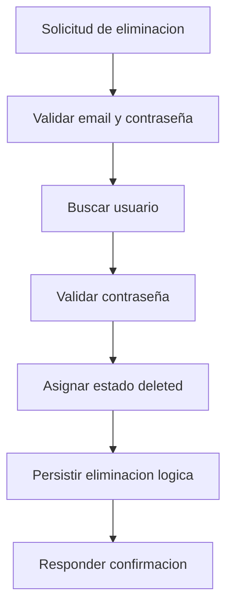

# UC-002 Eliminacion logica de cuenta

## Estado

Borrador

## Objetivo

Permitir que una cuenta quede eliminada logicamente validando la contraseña actual del usuario.

## Actores

- usuario no autenticado o cliente que conoce las credenciales actuales
- backend de usuarios

## Disparador

El usuario solicita eliminar su cuenta enviando email y contraseña.

## Precondiciones

- el usuario existe en el sistema
- existe el estado funcional `deleted`
- la contraseña informada coincide con la registrada

## Flujo principal

1. El usuario informa email y contraseña.
2. El backend valida que ambos campos esten presentes.
3. El backend busca el usuario por email.
4. El backend valida la contraseña informada.
5. El backend obtiene el estado funcional `deleted`.
6. El backend marca `deleted_at` y actualiza el estado del usuario.
7. El backend responde confirmacion.

## Diagrama Mermaid opcional

## Flujos alternativos

- Si falta email o contraseña, el flujo se rechaza por datos requeridos faltantes.
- Si el usuario no existe, el flujo se rechaza como no encontrado.
- Si la contraseña es incorrecta, el flujo se rechaza.
- Si no existe el estado `deleted`, el flujo se rechaza por error de configuracion.

## Reglas de negocio

- la eliminacion es logica y no fisica
- el usuario debe quedar con `deleted_at`
- el usuario debe quedar asociado al estado `deleted`

## Postcondiciones

- en caso exitoso, la cuenta queda eliminada logicamente
- en caso fallido, la cuenta conserva su estado previo

## Criterios de aceptacion

- dado un usuario existente con contraseña correcta, cuando solicita eliminar su cuenta, entonces el usuario queda con estado `deleted`
- dado un usuario inexistente, cuando solicita eliminar la cuenta, entonces el flujo responde no encontrado
- dado un usuario existente con contraseña incorrecta, cuando solicita eliminar la cuenta, entonces el flujo se rechaza
