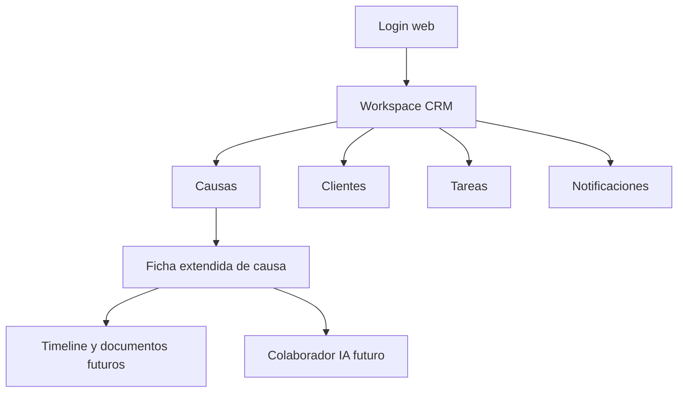

# UC-001 Web app CRM legal workspace

## Estado

Implementado parcialmente

## Objetivo

Definir la primera experiencia web de Legalito como espacio de trabajo principal para gestion CRM legal, concentrando vistas de escritorio para causas, clientes, tareas, notificaciones, documentos y futuras capacidades de colaboracion IA.

## Actores

- usuario autenticado
- backend Legalito
- app movil Legalito
- web app Legalito
- integraciones futuras con Poder Judicial
- colaborador IA futuro

## Disparador

El usuario accede a Legalito desde un navegador para realizar trabajo juridico de escritorio, gestion CRM o revision extendida de informacion.

## Precondiciones

- el usuario esta registrado y autenticado
- el backend expone APIs protegidas por JWT
- los datos visibles respetan ownership del usuario autenticado
- existe una API compartida que tambien puede ser consumida por la app movil

## Flujo principal

1. El usuario inicia sesion en la web app.
2. La web app carga un workspace inicial con resumen de trabajo.
3. El usuario consulta causas, clientes, tareas y notificaciones desde una navegacion de escritorio.
4. El usuario abre una ficha extendida de causa.
5. La web app muestra datos principales de causa, cliente asociado, tareas, vencimientos y señales de seguimiento.
6. El usuario gestiona tareas y proximas acciones sin modificar manualmente la relacion judicial base de la causa.
7. El usuario accede a secciones extendidas, como documentos, timeline o analisis, cuando esten disponibles.
8. La web app mantiene separacion entre informacion juridica base, operaciones CRM y capacidades futuras de IA.

## Diagrama Mermaid opcional

## Flujos alternativos

- Si el usuario no esta autenticado, se redirige a login.
- Si el backend rechaza el token, la sesion web debe cerrarse o solicitar nueva autenticacion.
- Si una causa no pertenece al usuario, no debe mostrarse informacion.
- Si una seccion extendida aun no esta implementada, la web app puede mostrar estado pendiente sin bloquear el workspace principal.
- Si una funcionalidad es mas apropiada para movil, la web app puede enlazar o complementar, pero no duplicar innecesariamente.

## Reglas de negocio

- la web app debe consumir contratos compartidos del backend
- la web app no debe saltarse ownership ni confiar en filtros client-side
- la web app es el canal preferente para trabajo juridico profundo
- la app movil mantiene foco en consulta rapida, alertas y acciones simples
- la ficha extendida de causa en web puede ser mas densa que la ficha movil
- las causas no se crean manualmente desde la ficha web en este corte
- la asignacion manual de cliente a causa queda fuera de este corte
- sincronizacion y descarga desde Poder Judicial quedan fuera de este corte salvo spec posterior
- capacidades IA futuras requieren specs especificos de confidencialidad, revision humana y trazabilidad

## Canales de experiencia

### Backend/API

- expone autenticacion y sesion
- expone causas visibles por usuario
- expone detalle de causa con ownership
- expone clientes del usuario
- expone tareas y filtros por causa o cliente
- expone notificaciones del usuario
- debe evolucionar como API compartida para mobile y web

### App movil

- mantiene experiencia resumida de causas
- muestra notificaciones y alertas
- permite crear y completar tareas simples
- permite revisar informacion principal fuera del escritorio

### Web app

- aloja dashboard inicial de trabajo
- aloja navegacion densa de CRM legal
- aloja ficha extendida inicial de causa
- aloja listado CRM de clientes
- aloja tareas, vencimientos y seguimiento operativo
- alojara documentos y timeline judicial/documental
- alojara colaborador IA, jurisprudencia y analisis de antecedentes
- alojara reportes y vistas comparativas
- alojara configuracion avanzada de cuentas e integraciones

## Modulos esperados del primer workspace

- `Dashboard`: implementado con resumen de causas, clientes, tareas pendientes y notificaciones
- `Causas`: implementado con listado, busqueda y ficha extendida inicial
- `Clientes`: implementado como listado CRM con datos de contacto y cantidad de causas asociadas
- `Tareas`: implementado como listado de acciones operativas con completado
- `Notificaciones`: implementado como bandeja de avisos
- `Documentos`: modulo reservado para gestion documental futura
- `IA`: modulo reservado para colaborador juridico futuro
- `Configuracion`: modulo reservado para cuentas de correo, preferencias e integraciones

## Estado de implementacion

- repo: `/Users/marcosceliz/Projects/Gescotec/legalito/legalito-web`
- stack: React, Vite, TypeScript, ESLint, CSS propio
- API configurada: `VITE_LEGALITO_API_URL=https://api.legalito.cl/api`
- commit inicial: `b079f5d Initial Legalito web workspace`
- validaciones ejecutadas:
- `npm run lint`
- `npm run typecheck`
- `npm run build`
- `npm audit --omit=dev`

Resultado:

- lint sin errores
- typecheck sin errores
- build productivo exitoso
- auditoria de produccion sin vulnerabilidades

## Postcondiciones

- el usuario cuenta con una superficie web para trabajo legal de escritorio
- los modulos web consumen la misma fuente de verdad del backend
- las diferencias entre mobile y web quedan explicitadas para futuros specs

## Criterios de aceptacion

- dado un usuario autenticado, cuando entra a la web app, entonces ve un workspace con resumen operativo
- dado un usuario autenticado, cuando abre causas, entonces solo ve causas asociadas a su identidad
- dado una causa visible, cuando abre la ficha extendida, entonces ve informacion principal, cliente asociado si existe y tareas vinculadas
- dado una causa sin cliente asociado, cuando se muestra en web, entonces no se exige asignacion manual
- dado una tarea vinculada a causa o cliente, cuando se consulta en web, entonces se respeta ownership
- dado un modulo aun no implementado, cuando aparece en navegacion, entonces debe mostrarse como pendiente o quedar oculto hasta estar disponible

## Alcance fuera de este corte

- sincronizacion directa con Poder Judicial
- gestion documental completa
- colaborador IA
- analisis de jurisprudencia
- reportes avanzados
- multiusuario por estudio juridico o roles internos complejos
